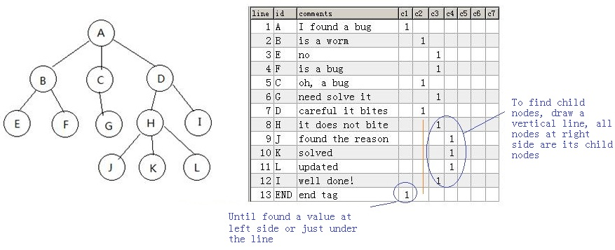

# Multiple-Columns-Tree
A new solution for save hierarchical data (Tree structure) in Database
一种新的树结构数据库存储方案

最近在开发jSqlBox过程中，研究树形结构的操作，突然发现一种新的树结构数据库存储方案，在网上找了一下，没有找到雷同的（也可能是花的时间不够），现介绍如下:
目前常见的树形结构数据库存储方案有以下四种，但是都存在一定问题:  
1)Adjacency List:：记录父节点。优点是简单，缺点是访问子树需要遍历，发出许多条SQL，对数据库压力大。  
2)Path Enumerations：用一个字符串记录整个路径。优点是查询方便，缺点是插入新记录时要手工更改此节点以下所有路径，很容易出错。  
3)Closure Table：专门一张表维护Path，缺点是占用空间大，操作不直观。  
4)Nested Sets：记录左值和右值，缺点是复杂难操作。  
以上方法都存在一个共同缺点：操作不直观，不能直接看到树结构，不利于开发和调试。  
本文介绍的方法我暂称它为“简单粗暴多列存储法”，它与Path Enumerations有点类似，但区别是用很多的数据库列来存储一个占位符(1或空值)，如下图(https://github.com/drinkjava2/Multiple-Columns-Tree/blob/master/treemapping.jpg) 左边的树结构，映射在数据库里的结构见右图表格：  


各种SQL操作如下：
```
1.获取(或删除)指定节点下所有子节点，已知节点的行号为"X",列名"cY":
select *(or delete) from tb where 
  line>=X and line<(select min(line) from tb where line>X and  (cY=1 or c(Y-1)=1 or c(Y-2)=1 ... or c1=1))
例如获取D节点及其所有子节点：
select * from tb where line>=7 and line< (select min(line) from tb where line>7 and (c2=1 or c1=1)) 
删除D节点及其所有子节点：
delete from tb where line>=7 and line< (select min(line) from tb where line>7 and (c2=1 or c1=1)) 

仅获取D节点的次级所有子节点：
select * from tb where line>=7 and c3=1 and line< (select min(line) from tb where line>7 and (c2=1 or c1=1)) 

2.查询指定节点的根节点, 已知节点的行号为"X",列名"cY":
select * from tb where line=(select max(line) from tb where line<=X and c1=1)
例如查I节点的根节点：
select * from tb where line=(select max(line) from tb where line<=12 and c1=1) 

3.查询指定节点的上一级父节点, 已知节点的行号为"X",列名"cY":
select * from tb where line=(select max(line) from tb where line<X and c(Y-1)=1)
例如查L节点的上一级父节点：
select * from tb where line=(select max(line) from tb where line<11 and c3=1) 

3.查询指定节点的所有父节点, 已知节点的行号为"X",列名"cY":
select * from tb where line=(select max(line) from tb where line<X and c(Y-1)=1)
union select * from tb where line=(select max(line) from tb where line<X and c(Y-2)=1)
...
union select * from tb where line=(select max(line) from tb where line<X and c1=1)
例如查I节点的所有父节点：
select * from tb where line=(select max(line) from tb where line<12 and c2=1)
union  select * from tb where line=(select max(line) from tb where line<12 and c1=1) 
 
4.插入新节点：
视需求而定，例如在J和K之间插入一个新节点T：
update tb set line=line+1 where line>=10;
insert into tb (line,id,c4) values (10,'T',1)
这是与Path Enumerations模式最大的区别，插入非常方便，只需要利用SQL将后面的所有行号加1即可，无须花很大精力维护path字串，  
不容易出错。
另外如果表非常大，为了避免update tb set line=line+1 造成全表更新，影响性能，可以考虑增加
一个GroupID字段，同一个根节点下的所有节点共用一个GroupID，所有操作均在groupID组内进行，例如插入新节点改为:
update tb set line=line+1 where groupid=2 and line>=8;
insert into tb (groupid,line,c4) values (2, 8,'T')
因为一个groupid下的操作不会影响到其它groupid,对于复杂的增删改操作甚至可以在内存中完成操作后，一次性删除整个group的内容  
并重新插入一个新group即可。
```

总结：  
以上介绍的这种方法优点有：  
1）直观易懂，方便调试，是所有树结构数据库方案中唯一所见即所得，能够直接看到树的形状的方案，空值的采用使得树形结构一目了然。  
2）SQL查询、删除、插入非常方便，没有用到Like语法。  
3）只需要一张表  
4)兼容所有数据库  
5)占位符即为实际要显示的内容应出现的地方，方便编写Grid之类的表格显示控件  

缺点有
1)不是无限深度树，数据库最大允许列数有限制，通常最多为1000，这导致了树的深度不能超过1000，而且考虑到列数过多对性能也有影响, 使用时建议定一个比较小的深度限制例如100。  
2)SQL语句比较长，很多时候会出现c9=1 or c8=1  or c7=1 ... or c1=1这种n阶乘式的查询条件  
3)树的节点整体移动操作比较麻烦，需要将整个子树平移或上下称动，当节点须要经常移动时，不建议采用这种方案。对于一些只增减，不常移动节点的应用如论坛贴子和评论倒比较合适。  
4)列非常多时，空间占用有点大。  

#==重要: 以下为追加内容，是在前述基础上，一种更简单的无限深度树方案==
突然发现上面的方法还是太笨了，如果不用多列而是只用一个列来存储深度等级，则可以不受数据库列数限制，从而进化为无限深度树，虽然不再具有所见即所得的效果，但是在性能和简单性上要远远超过上述“简单粗暴多列存储法”，暂时给它取名"朱氏深度树V2.0法"，方法如下：
如下图 (https://github.com/drinkjava2/Multiple-Columns-Tree/blob/master/treemapping.jpg) 左边的树结构，映射在数据库里的结构见右图表格，注意每个表格的最后一行必须有一个END标记，level设为0： 

```
1.获取指定节点下所有子节点，已知节点的行号为X,level为Y, groupID为Z
select * from tb2 where groupID=Z and 
  line>=X and line<(select min(line) from tb where line>X and level<=Y and groupID=Z)
例如获取D节点及其所有子节点：
select * from tb2 where groupID=1 and 
  line>=7 and line< (select min(line) from tb2 where groupid=1 and line>7 and level<=2)
删除和获取相似，只要将sql中select * 换成delete即可。

仅获取D节点的次级所有子节点：(查询条件加一个level=Y+1即可)：
select * from tb2 where groupID=1 and 
  line>=7 and level=3 and line< (select min(line) from tb2 where groupid=1 and line>7 and level<=2) 

2.查询任意节点的根节点, 已知节点的groupid为Z
select * from tb2 where groupID=Z and line=1 (或level=1) 

3.查询指定节点的上一级父节点, 已知节点的行号为X,level为Y, groupID为Z
select * from tb2 where groupID=Z and 
  line=(select max(line) from tb2 where groupID=Z and line<X and level=(Y-1))
例如查L节点的上一级父节点：
select * from tb2 where groupID=1 
  and line=(select max(line) from tb2 where groupID=1 and line<11 and level=3) 

3.查询指定节点的所有父节点, 已知节点的行号为"X",列名"cY":
select * from tb2 where groupID=Z and 
  line=(select max(line) from tb2 where groupID=Z and line<X and level=(Y-1))
union select * from tb2 where groupID=Z and 
  line=(select max(line) from tb2 where groupID=Z and line<X and level=(Y-2))
...
union select * from tb2 where groupID=Z and 
  line=(select max(line) from tb2 where groupID=Z and line<X and level=1)
例如查I节点的所有父节点：
select * from tb2 where groupID=1 and 
  line=(select max(line) from tb2 where groupID=1 and line<12 and level=2)
union  select * from tb2 where groupID=1 and 
  line=(select max(line) from tb2 where groupID=1 and line<12 and level=1)

4.插入新节点：例如在J和K之间插入一个新节点T：
update tb2 set line=line+1 where  groupID=1 and line>=10;
insert into tb (groupid,line,id,level) values (1,10,'T',4);
```

总结：
此方法优点有：  
1）是无限深度树  
2) 虽然不象第一种方案那样具有所见即所得的效果，但是依然具有直观易懂，方便调试的特点。   
2）能充分利用SQL，查询、删除、插入非常方便，SQL比第一种方案简单多了，也没有用到like模糊查询语法。  
3）只需要一张表。  
4) 兼容所有数据库。   
5) 点用空间小  

缺点有:  
1)树的节点整体移动操作有点麻烦, 适用于一些只增减，不常移动节点的场合如论坛贴子和评论等。当确实需要进行复杂的移动节点操作时，一种方案是在内存中进行整个树的操作并完成排序，操作完成后删除整个旧group再整体将新group一次性批量插入数据库。
